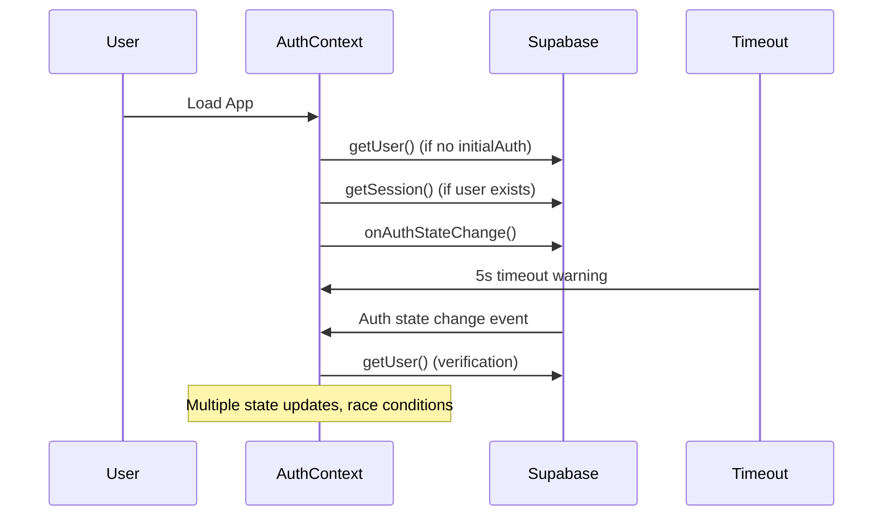
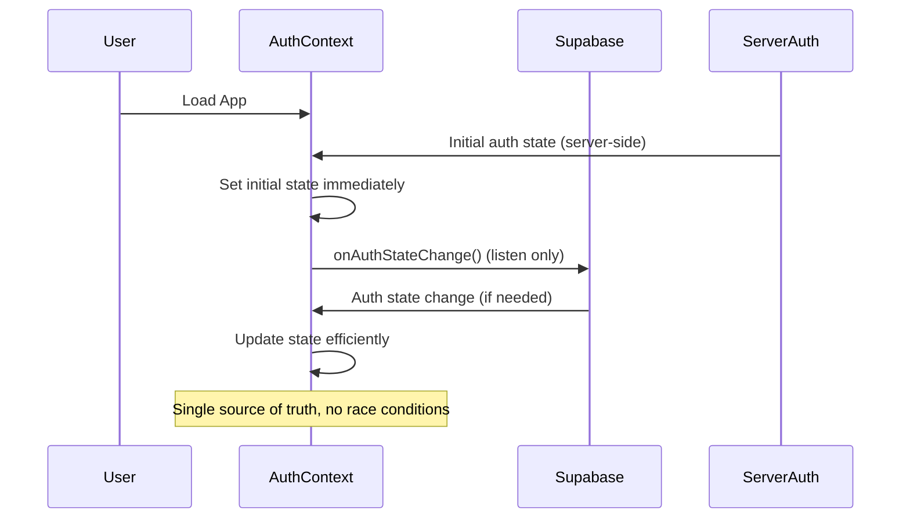

# Design Document

## Overview

The authentication timeout issue stems from race conditions and inefficient state management in the AuthProvider. The current implementation has several problems:

1. **Duplicate auth state changes**: The system triggers multiple auth state change events
2. **Inefficient verification**: Unnecessary `getUser()` calls on every auth state change
3. **Poor timeout handling**: 5-second timeout with generic error messages
4. **Race conditions**: Multiple async operations competing for state updates

The solution involves optimizing the authentication flow, improving state synchronization, and implementing better error handling.

## Architecture

### Current Flow Issues


### Improved Flow


## Components and Interfaces

### AuthProvider Improvements

**State Management**
- Use server-side auth as single source of truth for initial state
- Eliminate unnecessary `getUser()` verification calls
- Implement debounced state updates to prevent race conditions
- Add proper loading state management

**Timeout Handling**
- Reduce timeout from 5 seconds to 3 seconds
- Provide actionable error messages
- Implement retry mechanism for network issues
- Add connection status detection

**Error Handling**
- Categorize errors (network, auth, configuration)
- Provide specific error messages for each category
- Implement graceful degradation for offline scenarios
- Add error recovery mechanisms

### Server-Client Synchronization

**Initial State Hydration**
```typescript
interface InitialAuthState {
  user: User | null
  session: Session | null
  error: string | null
  timestamp: number // For cache validation
}
```

**State Update Strategy**
- Server-side auth takes precedence on initial load
- Client-side updates only for user-initiated actions
- Implement state reconciliation for conflicts
- Cache auth state with expiration

## Data Models

### Enhanced Auth Context Type
```typescript
interface AuthContextType {
  user: User | null
  session: Session | null
  loading: boolean
  error: string | null
  connectionStatus: 'online' | 'offline' | 'checking'
  lastUpdated: number
  signIn: (email: string, password: string) => Promise<{ error?: string }>
  signUp: (email: string, password: string, options?: SignUpOptions) => Promise<{ error?: string }>
  signOut: () => Promise<void>
  resetPassword: (email: string) => Promise<{ error?: string }>
  retry: () => Promise<void>
}
```

### Error Categories
```typescript
type AuthErrorType = 
  | 'network_error'
  | 'configuration_error' 
  | 'authentication_error'
  | 'timeout_error'
  | 'unknown_error'

interface AuthError {
  type: AuthErrorType
  message: string
  retryable: boolean
  action?: string
}
```

## Error Handling

### Error Classification
1. **Network Errors**: Connection issues, timeouts
   - Show retry button
   - Implement exponential backoff
   - Cache last known state

2. **Configuration Errors**: Missing env vars, invalid keys
   - Show configuration help
   - Prevent infinite retries
   - Log for debugging

3. **Authentication Errors**: Invalid credentials, expired tokens
   - Clear auth state
   - Redirect to login
   - Show appropriate message

4. **Timeout Errors**: Slow responses, hanging requests
   - Implement circuit breaker
   - Show connection status
   - Provide manual retry

### Recovery Mechanisms
- **Automatic retry**: For transient network issues
- **Manual retry**: User-initiated recovery
- **Fallback state**: Offline mode with cached data
- **Error boundaries**: Prevent app crashes

## Testing Strategy

### Unit Tests
- AuthProvider state management
- Error handling scenarios
- Timeout behavior
- State synchronization logic

### Integration Tests
- Server-client auth sync
- Auth state persistence
- Error recovery flows
- Network failure scenarios

### E2E Tests
- Login/logout flows
- Page refresh scenarios
- Network interruption handling
- Timeout recovery

### Performance Tests
- Auth initialization time
- Memory usage monitoring
- State update frequency
- Network request optimization

## Implementation Approach

### Phase 1: Core Fixes
1. Fix duplicate auth state changes
2. Optimize initial state loading
3. Improve timeout handling
4. Add better error messages

### Phase 2: Enhanced Features
1. Add connection status monitoring
2. Implement retry mechanisms
3. Add offline support
4. Enhance error categorization

### Phase 3: Performance & Monitoring
1. Add performance metrics
2. Implement auth analytics
3. Add debugging tools
4. Optimize bundle size

## Security Considerations

- Validate all auth tokens server-side
- Implement proper session management
- Add CSRF protection for auth endpoints
- Secure cookie configuration
- Rate limiting for auth attempts
- Audit logging for auth events